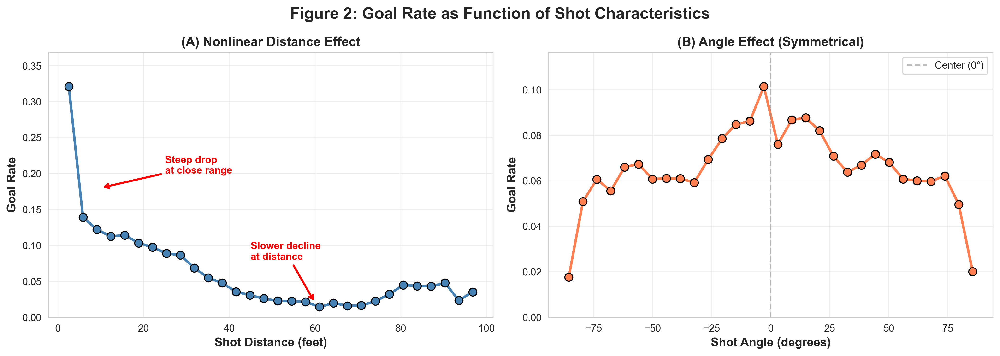
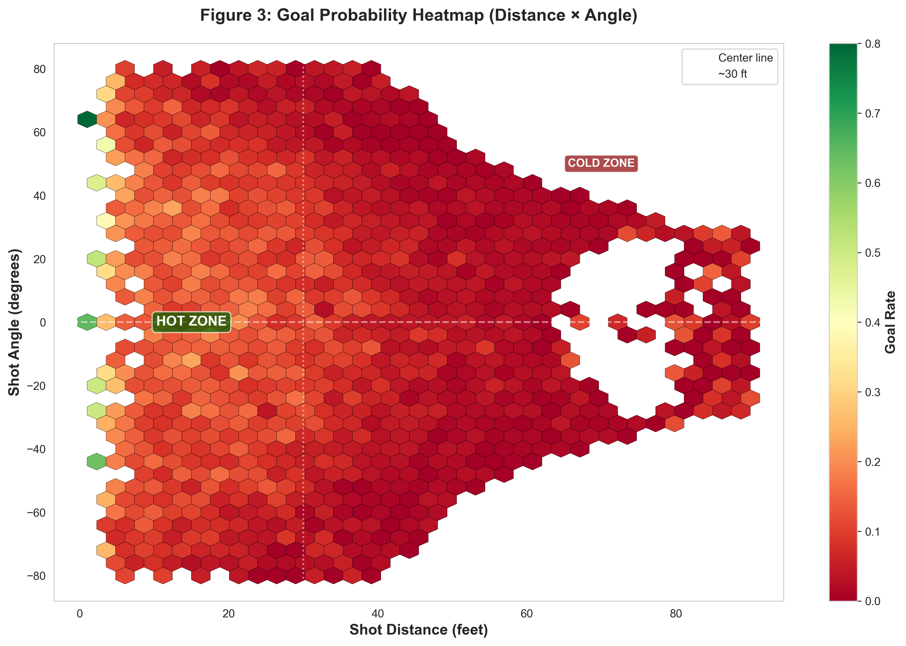
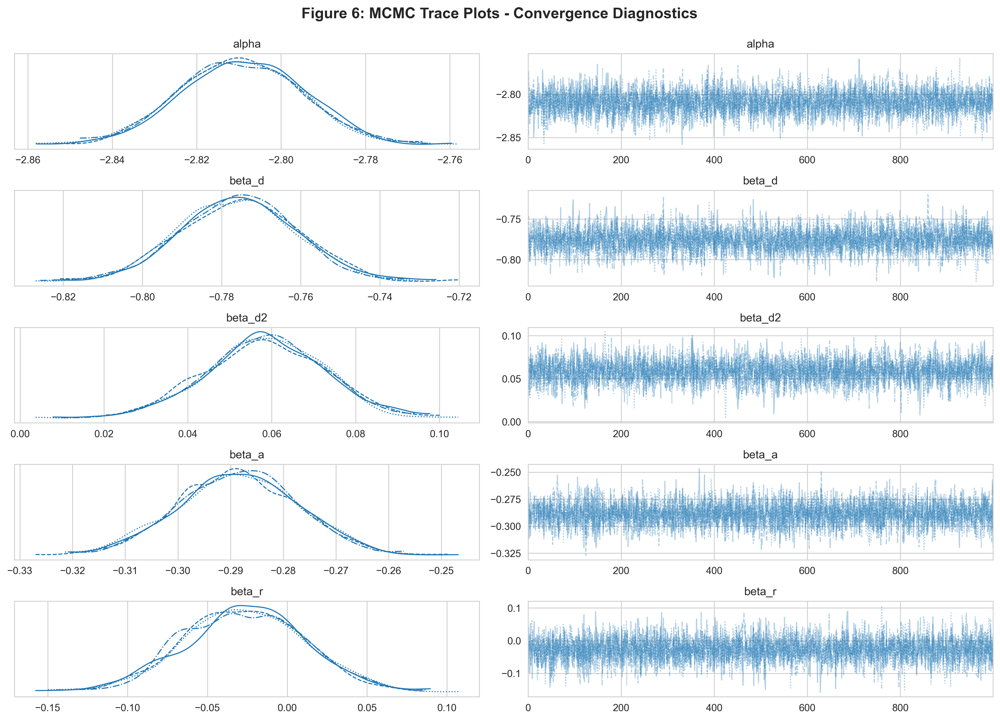
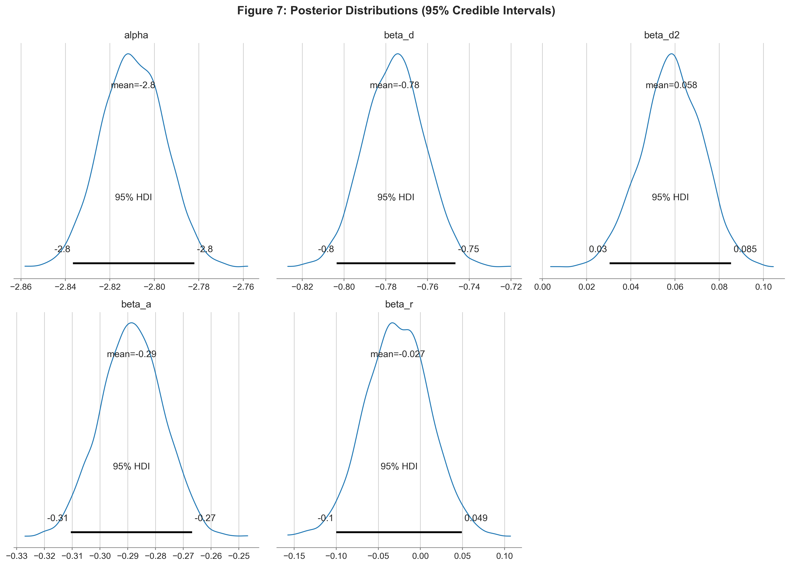
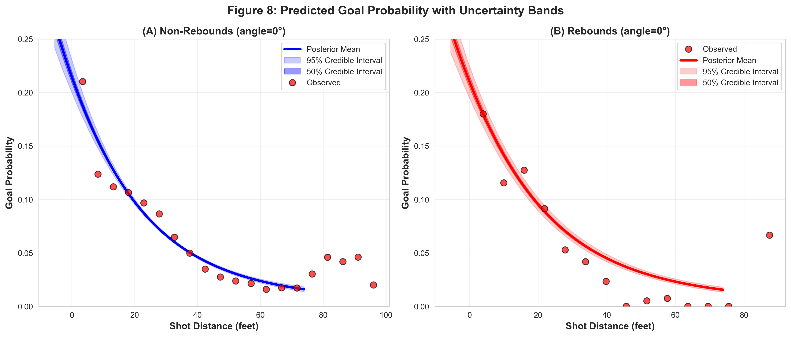
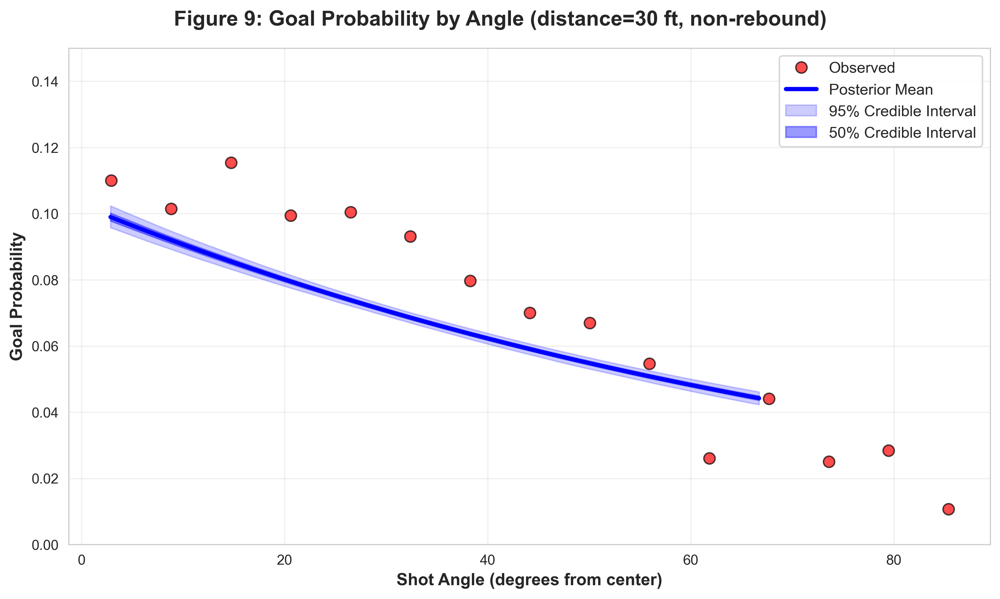
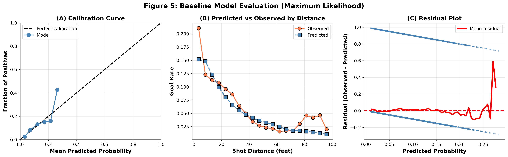

# NHL Shot Prediction Project
By: Sydney Marder

---

### (i) Introduction

Hockey analytics increasingly relies on data-driven decision making, and one of the most important tools used across the league is the expected goals (xG) model. These models estimate the probability that a shot becomes a goal based on its characteristics, helping teams evaluate scoring chances, optimize player positioning, and improve offensive efficiency. Although xG models are widely used, most implementations rely on maximum likelihood estimation and return only point estimates for parameters, This approach does not quantify parameter uncertainty, nor does it reveal how strongly distance, angle, and rebound status truly contribute to scoring probabilities, especially when those predictors may be correlated or have nonlinear effects.

In this project, we take a Bayesian approach and apply logistic regression with MCMC sampling to estimate goal probability for NHL shots. Using Bayesian inference allows us to move beyond a single "best-fit" model by providing full posterior distributions for each parameter. This framework gives us credible intervals, uncertainty quantification, and diagnostic tools to assess model stability and parameter interactions. MCMC also enables posterior predictive checks, which let us compare model-generated scoring patterns to real NHL data in a principled way.

Our central research questions are:
1. How do shot distance, shot angle, and rebound status affect the probability that a shot becomes a goal?
2. Is the distance effect nonlinear, as suggested by empirical scoring patterns?
3. Does the strong univariate rebound advantage persist once we control for shot location?

To answer these questions, we analyze 119,870 shots from the 2024 NHL season collected from MoneyPuck.com. Each observation includes the shot distance (in feet), the shot angle (in degrees), a binary rebound indicator, and whether the shot resulted in a goal. The dataset is complete with no missing values and exhibits a 7.03% overall goal rate, which aligns with typical NHL scoring frequencies. Basic descriptive statistics for the variables are show in the table below.

| Variable       | N       | Mean | Std Dev | Min    | Median | Max    |
|----------------|---------|------|---------|--------|--------|--------|
| Distance (ft)  | 119,870 | 34.22 | 19.85  | 1      | 32.8   | 98.41  |
| Angle (deg)    | 119,870 | 0.52 | 40.79   | -88.45 | 0      | 88.49  |
| Rebound (%)    | 119,870 | 7.46 | 26.27   | 0      | 0      | 100    |
| Goal (%)       | 119,870 | 7.03 | 25.57   | 0      | 0      | 100    |

These initial summaries highlight three important characteristics of the data. First, shot distance spans nearly the entire offensive zone (1-98 ft), suggesting a wide range of scoring environments. Second, shot angles are symmetrically distributed around the center line, which supports treating angle as a continuous predictor without distinguising left from right. Third, rebounds occur on about 7.5% of shots but have an outsized impact on scoring rate, motivating their inclusion as a key covariate. These patterns motivate a more detailed exploratory analysis to evaluate nonlinear distance effects, angle penalties, and the stability of the rebound advantage across locations.

Following our exploratory analysis, we fit a baseline logistic regression using maximum likelihood estimation to establish a comparison point, We then develop a Bayesian logistic regression model with weakly informative priors, implemented in PyMC3. Using four MCMC chains and a total of 4,000 posterior draws, we assess convergence using trace plots, effective sample sizes, and standard diagnostics. The Bayesian framework allows us to formally quantify uncertainty in each effect, distance, angle, and rebound status, and to evaluate how these variables interact to shape goal probability across the offensive zone.

These descriptive patterns underline the importance of modeling shot quality in a way that captures both the nonlinearity of distance and the contextual boost provided by rebounds. After establishing these empirical relationships, we turn to statistical modeling to quantify how each factor influences goal probability while appropriately accounting for uncertainty in the estimates.

### (ii) Models

Exploratory analysis revealed three key patterns that guided the structure of our statistical model. First, goal probability declines nonlinearly with distance: close-range shots (<15 ft) convert at roughly 13%, while attempts beyond 60 ft drop to ~2%. The steep decline at short distances followed by a slower tapering suggest a concave relationship, motivating a quadratic distance term (Figure 2A). Second, shot angle displays a clear symmetric pattern around center ice, straight-on shots (0$\degree$) achieve the highest scoring rates, with probability decreasing smoothly toward the boards (Figure 2B). Third, the two-dimensional heatmap highlights the well-known "slot" region (15-30 ft, centered) as the highest-danger scoring area in the offensive zone (Figure 3). Together, these patterns support using quadratic distance, absolute angle, and a spatially interpretable formulation consistent with established hockey strategy and xG modeling practice.

Figure 2. Goal rate as a function of (A) distance and (B) angle, illustrating nonlinear distance decay and a symmetric angle effect

Figure 3. Goal probability heatmap identifying the highest-danger "slot" region (15-30 ft, center ice)

**Model Specification**

Let $goal_i \isin \{0, 1\}$ denote the outcome of shot $i$. We model scoring probability using a logistic regression framework:

$$
goal_i \sim Bernoulli(p_i)
$$

$$
\text{logit}(p_i) = \alpha + \beta_d \cdot d_i + \beta_{d2} \cdot d_i^2 + \beta_a \cdot a_i + \beta_r \cdot r_i
$$

where

- $d_i$ = standardized shot distance
- $a_i$ = standardized absolute shot angle
- $r_i$ = rebound indicator (1 = rebound, 0 = non-rebound)

Standardizing distance and angle (mean = 0, SD = 1) improves numerical stability and allows for interpretable weakly informative priors

**Prior Specification**

We assign weakly informative priors that encode directional expectations derived from the EDA while still allowing the large sample size ($n = 119,870$) to dominate inference:

$$
\alpha \sim \mathcal{N}(-2.5, 1.0)
$$
(reflects the empirical base rate $log(0.07 / 0.93) \approx -2.5$)

$$
\beta_d \sim \mathcal{N}(-0.5, 0.5)
$$
(steep negative distance effect at close range)

$$
\beta_{d2} \sim \mathcal{N}(-0.1, 0.3)
$$
(negative curvature with smaller magnitude)

$$
\beta_a \sim \mathcal{N}(-0.2, 0.3)
$$
(angle penalty consistent with symmetric pattern)

$$
\beta_r \sim \mathcal{N}(0.5, 0.3)
$$
(rebound advantage; $log(1.73) \approx 0.55$)

This priors regularize the logistic model without being restrictive. Standard deviations of 0.3-1.0 ensure the posterior remains driven primarily by the data.

**Likelihood and Inference**
The Bernoulli likelihood with a logistic link transforms linear predictors into scoring probabilities:

$$
p_i = \frac{1}{1 + \exp{-\text{logit}(p_i)}}
$$

Posterior sampling is performed with the No-U-Turn-Sampler (NUTS), the Hamiltonian Monte Carlo algorithm implemented in PyMC3. We run 4 chains with 1,000 draws each (plus 500 tuing iterations), yielding 4,000 posterior samples used for inference, uncertainty quantification, and posterior predictive checks.

For comparison, we also fit maximum likelihood model using scikit-learn's LogisticRegression with L2 regularization ($C = 1.0$). The MLE model provides point estimates only, allowing direct contrast with the Bayesian approach, which produces full posterior distributions and credible intervals.

 ### (iii) Results and Discussion

 All MCMC chains converged cleanly: $\hat{r} = 100$ for  all parameters, with effective samples sizes exceeding 3,600 (Table 4). The trace plots in Figure 6 show well-mixed chains with no drift and smooth posterior densities, indicating stable sampling and reliable inference.

Figure 6. Trace plots confirm convergence: smooth posterior densities (left) and well-mixed chains (right).

Posterior means and 95% credible intervals appear in Table 4 and are visualized in Figure 7.

Table 4. Posterior means, 95% credible intervals, odds ratios, and convergence metrics.

| Parameter           | Posterior Mean | 95% CI Lower | 95% CI Upper | Odds Ratio | ESS  | R-hat |
|---------------------|----------------|--------------|--------------|------------|------|-------|
| α (Intercept)       | -2.81          | -2.8374      | -2.7826      | 0.0602     | 3692 | 1.00  |
| β_d (Distance)      | -0.776         | -0.8054      | -0.7466      | 0.4602     | 3713 | 1.00  |
| β_{d2} (Distance²)  | 0.058          | 0.0306       | 0.0854       | 1.0597     | 3873 | 1.00  |
| β_a (Angle)         | -0.289         | -0.3106      | -0.2674      | 0.749      | 4428 | 1.00  |
| β_r (Rebound)       | -0.027         | -0.1015      | 0.0475       | 0.9734     | 4167 | 1.00  |

Figure 7. Posterior distributions with 95% highest-density intervals (black bars).

**Predictive Preformance with Uncertainty Bands**

Figure 8 displays predicted goal probability versus distance for non-rebounds (panel A) and rebounds (panel B), with 95% and 50% credible intervals derived from posterior samples. The model captures observed patterns closely: red points align with posterior mean predictions (solid lines). Credible intervals remain narrow across the entire distance range, indicating high confidence in predictions given the very large sample size.

At 30 ft (center, non-rebound), predicted probability is 5.6% with a 95% CI of [5.5%, 5.7%], a width of only 0.3 percentage points. At 50 ft, predicted probability drops to 3.3% [3.1%, 3.4%]. These tight intervals reflect well-identified parameters with ESS values exceeding 3600.

Panels A and B are nearly identical, visualizing the near-zero rebound coefficient (β_r ≈ -0.03, CI spans zero). The univariate rebound advantage seen in exploratory analysis disappears once distance and angle are accounted for, confirming rebounds are not inherently higher-probability shots—rather, they cluster near the net.

Figure 9 examines angle effects at a fixed distance of 30 ft for non-rebounds. Predicted probability declines from roughly 10% at center to about 4% at 60° peripheral. Credible intervals remain narrow, reflecting stable angle estimates.

Figure 8: Predicted goal probability vs. distance with uncertainty quantification. Solid lines show posterior means; shaded bands show 50% (dark) and 95% (light) credible intervals. Red points indicate observed binned rates.

Figure 9: Predicted goal probability vs. angle at 30 ft (non-rebounds), showing a monotonic decline with narrow credible intervals.

**Model Performance and Comparison to MLE**

A baseline maximum likelihood logistic regression achieves AUC = 0.71 and Brier score = 0.063, indicating good discrimination and calibration (Figure 5). Bayesian approach yields richer information:
- credible intervals quantify uncertainty,
- posterior distributions allow direct probability statements (e.g., $\beta_d$ is negative with >99.9% probability)
- and unvetainty naturally propagates into predictive distributions.

**Distance and Angle Effects**

The distance effect is strongly negative ($\beta_d = -0.78$, 95% CI: $[-0.81, -0.75]$), meaning a one-standard deviation increase in distance (19.85 ft) reduces scoring odds by roughly 54% (OR = 0.46). This aligns with hockey fundamentals: shots taken farther from the net are significantly less dangerous.

The angle effect is moderate but meaningful. The estimate $\beta_a = -0.29$ (95% CI: $[-0.31, -0.27]$) implied that moving one standard deviation outward in angle (40.8$\degree$) decreases scoring odds by about 25%. This matches hockey intuition, centered shots are more threatening than those taken from the boards or sharp angles.

These findings reinforce what coaches emphasize: crash the net, shoot from the slot, and stay near center ice whenever possible.

**Quadratic Term and Multicollinearity**

A surprising result is the positive quadratic coefficient ($\beta_{d2} = 0.058$) despite the EDA showing concave decay. This occurs because distance and distance$^2$ are extremely correlated ($r = 0.95$), causing multicollinearity that destabilizes individual coefficient signs. In practice, the linear term captures nearly the entire effect of distance; the quadratic term adds little but becomes noisy under strong collinearity.

Thus, the sign flip is a modeling artifact, not evidence of an actual convex scoring pattern.

**Rebound Effect and Confounding**

The rebound effect is statistically indistinguishable from zero ($\beta_r = -0.027$, 95% CI: [-0.10, 0.05]). This contradicts the univariate rebound advantage (1.73x higher scoring rate) but reveals spatial confounding: rebound shots overwhelmingly occur near the net, where distance alone explains elevated scoring rates. After adjusting for distance and angle, rebound shots overwhelmingly occur near the net, where distance alone explains elevated scoring rates. After adjusting for distance and angle, rebound status provides no meaningful additional information.

This is a classic example of how multivariate modeling can overturn misleading univariate patterns.

**Interpretation in Hockey Context**

Distance overwhelmingly drives shot quality: moving just 20 ft farther from the net cuts scoring probability by about half. Angle matters, but much less so—roughly a 25$\degree$ shift corresponds to a 25% reduction in scoring odds. The model also correctly identifies the slot (15–30 ft, center) as the premier scoring region, perfectly matching coaching principles about generating “high-danger chances.”

**Modeling Challenges and Limitations**

Two Issues deserve to be mentioned:

1. Multicollinearity: Distance and distance$^2$ are highly correlated, complicating interpretation of individual coefficients. Using splines or GAMs may better capture nonlinear distance effects without collinearity.

2. Spatial confounding of rebounds: Rebounds appear dangerous univariately because they occur close to the net. Once distance/angle are controlled for, rebound status adds no predictive value. A more complete model could include shot type, traffic, goalie movement, or possession sequence features.

Other limitations include measurement noise in play-by-play coordinates (2-5 ft error), omission of game state and shot type, and the use of a quadratic functional form that may not fully capture complex distance effects.

### (iv) Conclusion

This study provides a detailed, data-driven look at how distance, angle, and rebound status influence NHL scoring probability, and it demonstrates how Monte Carlo methods can strengthen hockey analytics. Using nearly 120,000 shots, we confirmed that distance is overwhelmingly the strongest predictor of goal likelihood, with scoring odds dropping by roughly half for every 20 additional feet. Angle plays a meaningful but smaller role, reducing scoring odds as shooters move away from the center line. These findings reaffirm long-standing coaching observations about the importance of the slot and the value of generating close, centered chances.

Monte Carlo sampling adds an important dimension to this analysis. Instead of relying on a single set of point estimates—as in traditional maximum likelihood expected-goals models—PyMC3’s NUTS sampler produces full posterior distributions for each parameter. This allows us to quantify uncertainty, assess robustness, and understand not just what the effects are but how confident we are in them. For example, the tight credible interval around the distance coefficient shows extremely high certainty about its negative impact, while the wide interval for rebounds clarifies that the apparent univariate advantage disappears once shot location is accounted for. These insights are clearer and more transparent because MCMC directly approximates the posterior through repeated, well-mixed samples rather than through asymptotic approximations.

Bridging hockey analytics and Monte Carlo methods also highlights the practical benefits of Bayesian approaches. The Bayesian model closely matched the MLE estimates—expected with such a large dataset—but provided richer interpretability. Posterior predictive checks, HDIs, and uncertainty propagation make it easier to understand how the model behaves across different shot scenarios. These tools are especially valuable when patterns are subtle or confounded, such as the rebound effect or the unexpected sign flip in the quadratic distance term, both of which required careful interpretation. MCMC methods reveal not just the “best” answer but the range of plausible answers the data support.

Finally, this project illustrates how Monte Carlo methods offer a flexible foundation for advancing hockey models further. As analysts incorporate shot type, goalie behavior, player effects, or spatial smoothing, likelihoods become more complex and parameter interactions harder to interpret. MCMC scales naturally to these richer models, enabling uncertainty-aware analysis where classical techniques may struggle. Even with its limitations—rink coordinate noise, omitted contextual variables, and a simple quadratic specification—this model demonstrates that Bayesian inference can enrich expected-goals modeling by quantifying uncertainty, clarifying confounding, and grounding hockey strategy in transparent probabilistic reasoning.

### (v) Sources

**Data**

MoneyPuck. (2024). NHL Shot Data. https://moneypuck.com/data.htm

**Background**

Hockey Reference. (2024). NHL Historical Statistics and Data. 
https://www.hockey-reference.com/

Evolving-Hockey. (2024). Expected Goals Models and Analytics. Retrieved 
from https://evolving-hockey.com/